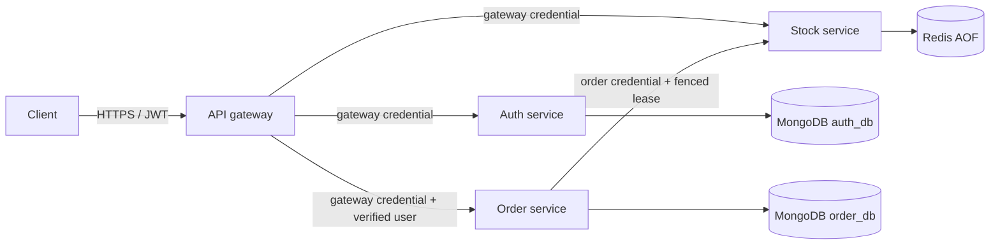
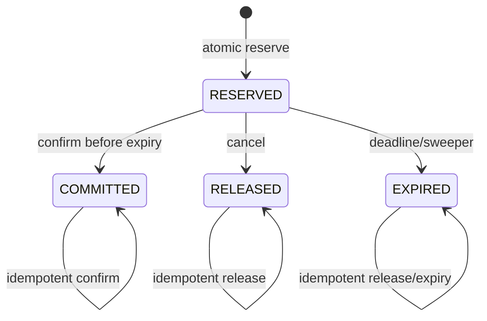
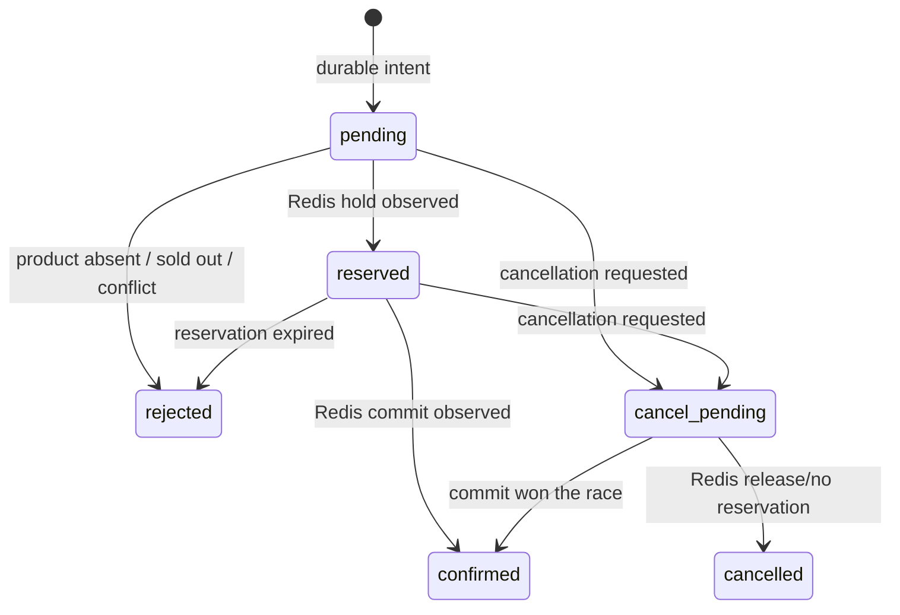
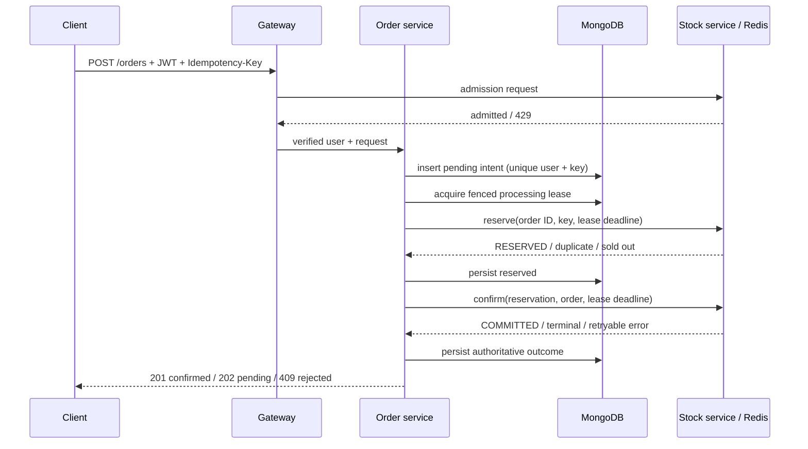

# Architecture

## Components and trust boundaries



Only the gateway is externally published. The gateway strips caller-supplied service and identity headers, verifies JWT signature, algorithm, issuer, audience, and expiry, and injects the verified subject and role. The gateway and order service use different service credentials. Stock routes authorize the exact calling service: gateway routes cover admission and inventory administration; order routes cover reservation transitions.

## Data ownership

| Owner | Durable/operational data |
|---|---|
| Auth service | Users, password hashes, roles in `auth_db` |
| Order service | Order intent, idempotency key, reservation ID, state, retry/lease metadata in `order_db` |
| Stock service | Live per-product inventory, reservations, expiry schedule, admission counters in Redis |

MongoDB is the durable source for whether an order was accepted and its last known business state. Redis is the serialized inventory transition engine. Redis AOF reduces restart loss, but Redis is not treated as infallible; missing inventory fails closed and requires reconciliation.

## Inventory state machine



All transitions and counter changes execute in one Redis Lua invocation. `COMMITTED`, `RELEASED`, and `EXPIRED` are terminal. At the exact expiry deadline, expiry wins. Concurrent confirm/release calls serialize in Redis; the first valid terminal transition wins.

Per product, the intended invariant is:

```text
initial = available + reserved + sold
available >= 0
reserved >= 0
sold >= 0
```

## Order state machine



`pending`, `reserved`, and `cancel_pending` are recoverable states. `confirmed`, `rejected`, and `cancelled` are terminal.

## Reservation saga



A network timeout is treated as unknown, never as definite failure. Recovery retries the same deterministic identifiers. Redis returns the existing reservation state instead of decrementing again.

## Recovery worker

Each order-service replica atomically claims one due order using `findOneAndUpdate`. The lease contains a unique token and deadline. Mongo updates require the same token and an unexpired deadline. Redis reserve/confirm/release scripts also reject an expired deadline. A stale worker therefore cannot apply a new inventory mutation or persist a result after its lease expires. If it completed a Redis operation but lost the response, the next worker observes that idempotent Redis state.

Retries use bounded exponential backoff (250 ms to 30 s). Invalid product, sold-out, and idempotency conflicts become terminal rejections. Infrastructure failures remain visible as recoverable pending/reserved orders.

## Admission control

The gateway asks the stock service for admission before creating an order. A Redis Lua script enforces configurable fixed-window global and per-user limits. It protects downstream services but does not claim strict queue ordering or global first-come-first-served fairness.

## Deliberate omissions

- No Kafka: current correctness comes from deterministic retries and durable order intents.
- No payment workflow: `COMMITTED` represents allocated inventory, not captured payment.
- MongoDB and Redis are single instances in the provided local/baseline manifests; production HA requires an external design review.
- No cross-database atomic transaction exists. The saga explicitly handles that boundary.
