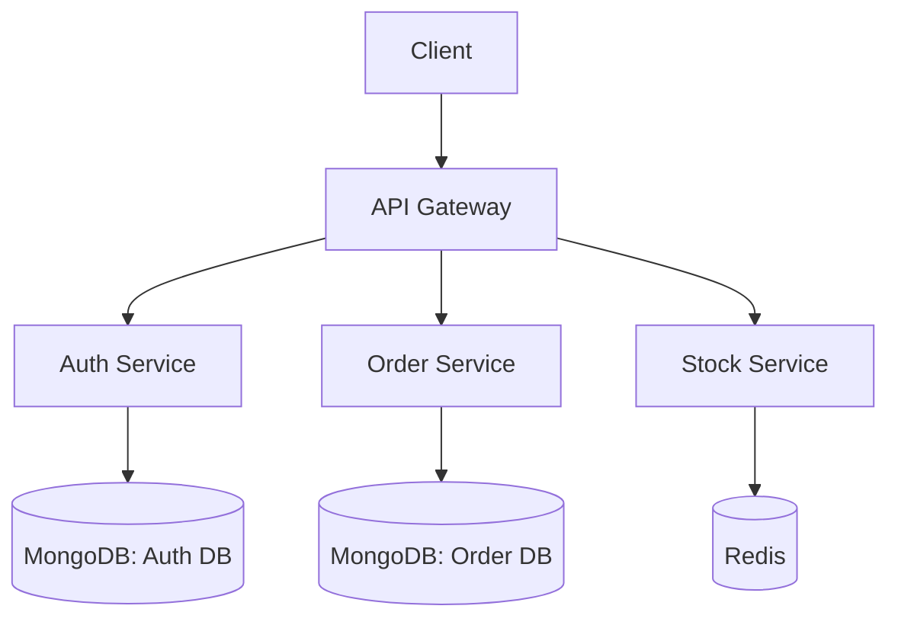
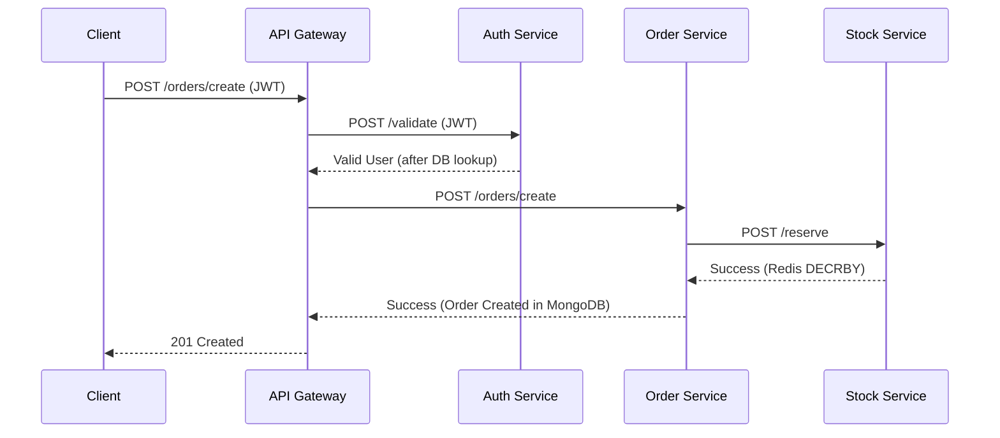

# 02 — System Architecture

## 1. Architecture Style

FlashFlow's **actual, implemented** architecture is a **synchronous, HTTP-based microservices architecture** deployed on Kubernetes. It is *not* the event-driven architecture described in the original vision document — there is no message broker in the current codebase.



## 2. Services

| Service | Role | Datastore | Entry point |
|---|---|---|---|
| `api-gateway` | Edge/proxy, JWT enforcement, request routing | none (stateless proxy) | `src/index.js` |
| `auth-service` | User identity, JWT issuance & validation | MongoDB (`auth_db`) | `src/index.js` |
| `stock-service` | Inventory counter | Redis | `src/index.js` |
| `order-service` | Order persistence | MongoDB (`order_db`) | `src/index.js` |

Each service follows an identical MVC-like layout:
```
src/
├── app.js            # Express app + middleware
├── index.js           # Entry point
├── controllers/       # Route handlers / business logic
├── routes/             # URL → controller mapping
├── models/             # Mongoose schemas (where applicable)
├── db/                 # DB connection logic
└── utils/              # ApiError, ApiResponse, AsyncHandler
```

**Layers:**
- Routing layer: `routes/`
- Controller/business logic layer: `controllers/`
- Data access layer: `models/` + direct Redis client calls

## 3. Communication Flow (as implemented)

All inter-service calls are **synchronous HTTP** via `node-fetch` — there is no async messaging layer.



**Known consequence of this design:** because Auth Service is called synchronously on *every* protected request and performs a database lookup each time, it is the system's primary bottleneck — the "Auth Choke" problem that the original Monolith→Microservices migration was meant to solve, but which persists in a different form due to the synchronous validation call.

## 4. Deployment Topology

- **Local dev:** Docker Compose spins up all 4 services + Redis + MongoDB.
- **Production:** Kubernetes — each service is an independent Deployment behind a Service object, fronted by an Nginx Ingress Controller. Horizontal Pod Autoscaler (HPA) scales each service's pod count based on CPU load.
- Confirmed present in the repo: Dockerfiles per service, `docker-compose.yml`, and a `K8s/` folder with Deployment, Service, Ingress, HPA, and Secret manifests.
- **Not present:** any CI/CD pipeline definition (no GitHub Actions workflows were found despite being referenced in the vision doc).

## 5. Isolation Benefit (what actually works)

The one architectural win that *is* real and testable: because each service runs as independent pods, a CPU spike in `auth-service` (e.g., from bcrypt hashing under login load) does not directly crash `order-service` or `stock-service` — they scale and fail independently. This was validated in the k6 load test (see `09-Load-Testing.md`).

## 6. Architectural Gaps vs. the Original Vision

| Vision component | Status |
|---|---|
| Kafka event bus | Not implemented |
| Pricing Engine microservice | Not implemented |
| PostgreSQL source of truth | Not implemented (MongoDB is used instead) |
| Reservation TTL / expiration | Not implemented |
| Circuit breakers | Not implemented |
| Distributed tracing | Not implemented |

See `07-Future-Roadmap.md` for how these could realistically be added, and `10-Architecture-Decisions.md` for the reasoning behind the current design choices.
